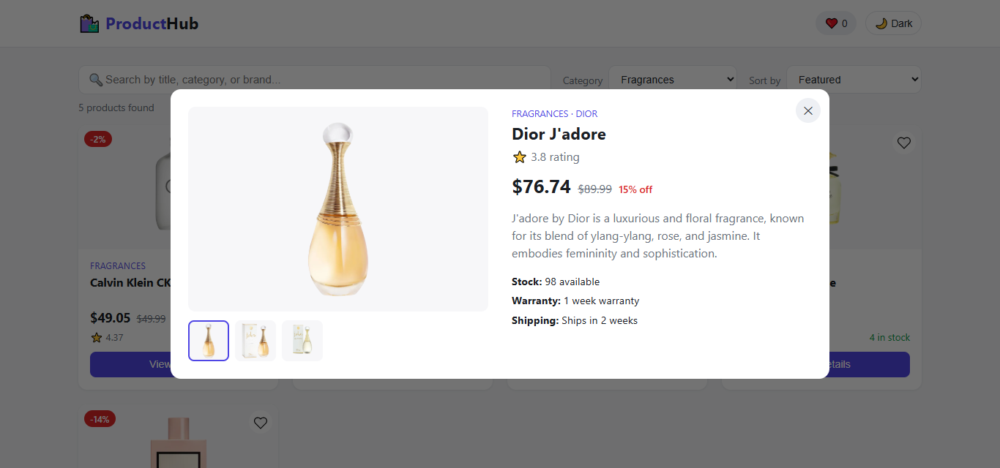

# ProductHub — Product Listing Application

A responsive product listing app built with React + Vite. It fetches live
data from the [DummyJSON Products API](https://dummyjson.com/products) and
lets users search, filter, sort, and view full details for each product.

## Features

- **Product grid** — image, title, category, original price, discounted
  price, rating, and stock status on every card.
- **Search** — live search across product title, category, and brand as you type.
- **Category filter** — dropdown populated from the live categories endpoint, with an "All Categories" option.
- **Sorting** — Price (low→high / high→low), Rating (high→low), Name (A→Z).
- **Product details modal** — image gallery, description, brand, category,
  price/discount breakdown, rating, stock, warranty, and shipping info.
- **Loading state** — animated skeleton cards while data is fetching.
- **Error handling** — friendly error message with a Retry button if the API call fails.
- **Empty state** — "No products found" message when search/filters return nothing.
- **Responsive design** — works on mobile, tablet, laptop, and desktop.
- **Bonus:** favorites (❤️) saved to Local Storage, and a dark/light theme toggle.

## Tech Stack

- React 19 (functional components, hooks: `useState`, `useEffect`, `useMemo`)
- Vite (build tool / dev server)
- Plain CSS with CSS variables for theming (no external UI framework)

## Project Structure

```
src/
├── components/
│   ├── Header.jsx / Header.css
│   ├── SearchBar.jsx / SearchBar.css
│   ├── CategoryFilter.jsx / CategoryFilter.css
│   ├── SortDropdown.jsx
│   ├── ProductCard.jsx / ProductCard.css
│   ├── ProductGrid.jsx / ProductGrid.css
│   ├── ProductModal.jsx / ProductModal.css
│   ├── Loader.jsx / Loader.css
│   └── ErrorMessage.jsx / ErrorMessage.css
├── pages/
│   └── Home.jsx          # main page — owns all state, composes everything above
├── services/
│   └── productApi.js     # fetchProducts(), fetchCategories()
├── App.jsx
├── main.jsx
└── index.css              # design tokens (light/dark), base + responsive styles
```

Product details are shown in a **modal** (opened from "View Details"), which
satisfies the requirement without needing client-side routing. If you'd
rather have a separate `/product/:id` page, swapping in `react-router-dom`
and moving `ProductModal`'s JSX into a `pages/ProductDetails.jsx` route is a
drop-in change — `Home.jsx` already isolates that piece of state.

## Setup & Installation

1. **Prerequisites:** Node.js 18+ and npm installed.
2. **Install dependencies:**
   ```bash
   npm install
   ```
3. **Run the dev server:**
   ```bash
   npm run dev
   ```
   Open the printed local URL (usually `http://localhost:5173`).
4. **Build for production:**
   ```bash
   npm run build
   ```
   Output goes to `dist/`.
5. **Preview the production build locally:**
   ```bash
   npm run preview
   ```

## Deployment (Vercel / Netlify)

**Vercel:**
1. Push this repo to GitHub.
2. Import the repo in Vercel → Framework preset: **Vite**.
3. Build command: `npm run build`, Output directory: `dist`. Deploy.

## Live Demo 
https://product-listing-app-ebon-three.vercel.app/

**Netlify:**
1. Push this repo to GitHub.
2. New site from Git → Build command: `npm run build`, Publish directory: `dist`.

## Notes on Implementation

- All product data is fetched once on mount (`?limit=100`) so that search,
  filtering, and sorting can run instantly client-side rather than
  round-tripping to the API on every keystroke.
- Discounted price is computed as `price - (price * discountPercentage / 100)`.
- Favorites and the selected theme persist in `localStorage`, so they survive
  a page refresh.
## ScreenShots
## Home Page


## Product Selectio


## Dark Theme

