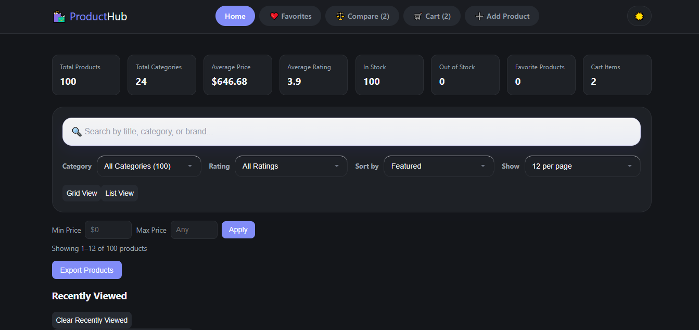
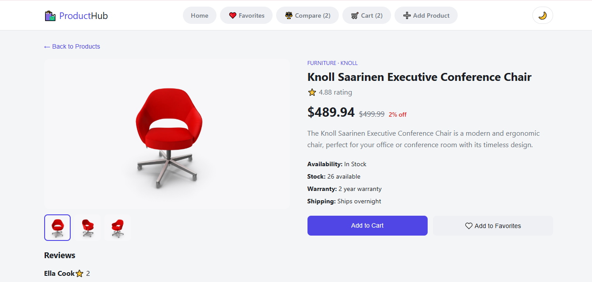
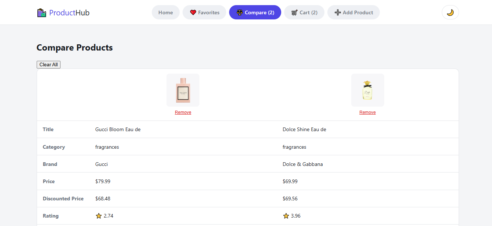
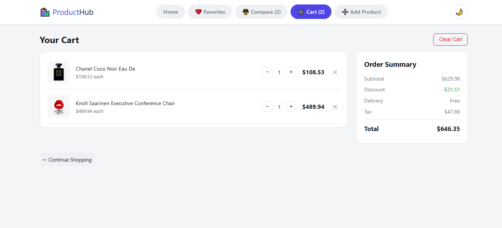

# ProductHub — Product Listing Application

A responsive product listing app built with React + Vite. It fetches live
data from the [DummyJSON Products API](https://dummyjson.com/products) and
lets users search, filter, sort, and view full details for each product.

## Features

## Features

- **Product Grid** – Switch between responsive grid and list layouts with the selected view saved in Local Storage.
- **Product Search** – Live search across product title, category, and brand with debouncing.
- **Category Filter** – Filter products by category with dynamic product counts.
- **Price Range Filter** – Filter products using minimum and maximum price.
- **Rating Filter** – Filter products based on minimum rating.
- **Sorting** – Sort products by price (Low → High / High → Low), rating, and name.
- **Pagination** – Adjustable products per page with page navigation.
- **Product Details** – View complete product information on a dedicated page.
- **Favorites** – Add or remove products from favorites using Local Storage.
- **Shopping Cart** – Add products to cart, update quantity, remove items, and view total price.
- **Product Comparison** – Compare multiple products side by side.
- **Recently Viewed Products** – Automatically tracks recently viewed products.
- **Add Product** – Create new products with form validation and Local Storage persistence.
- **Edit Product** – Update locally created products.
- **Delete Product** – Remove locally added products.
- **Export Products** – Export the currently filtered products to CSV.
- **Responsive Design** – Optimized for desktop, tablet, and mobile devices.
- **Dark / Light Theme** – Theme preference saved in Local Storage.
- **Loading & Error States** – Skeleton loaders, retry option, and empty state handling.
- **Lazy Loaded Routes** – Faster page loading using React.lazy() and Suspense.
- **URL Search Parameters** – Search, filters, sorting, and pagination are preserved in the URL.

## Tech Stack

- React 19 (functional components, hooks: `useState`, `useEffect`, `useMemo`)
- Vite (build tool / dev server)
- Plain CSS with CSS variables for theming (no external UI framework)

## Project Structure

```
├── src/
│   │
│   ├── components/              # Reusable UI components
│   │   ├── CartItem.jsx
│   │   ├── CartSummary.jsx
│   │   ├── CategoryFilter.jsx
│   │   ├── ConfirmationModal.jsx
│   │   ├── EmptyState.jsx
│   │   ├── Header.jsx
│   │   ├── Pagination.jsx
│   │   ├── PriceRangeFilter.jsx
│   │   ├── ProductCard.jsx
│   │   ├── ProductComparisonTable.jsx
│   │   ├── ProductForm.jsx
│   │   ├── ProductGrid.jsx
│   │   ├── ProductStatistics.jsx
│   │   ├── ProductsPerPage.jsx
│   │   ├── RatingFilter.jsx
│   │   ├── ReviewSection.jsx
│   │   └── (Component CSS files)
│   │
│   ├── hooks/                   # Custom React Hooks
│   │   ├── useCart.js
│   │   ├── useComparison.js
│   │   ├── useDebounce.js
│   │   ├── useFavorites.js
│   │   ├── useLocalStorage.js
│   │   ├── useProducts.js
│   │   ├── useRecentlyViewed.js
│   │   └── useTheme.js
│   │
│   ├── pages/                   # Application Pages
│   │   ├── Home.jsx
│   │   ├── ProductDetails.jsx
│   │   ├── AddProduct.jsx
│   │   ├── Cart.jsx
│   │   ├── Compare.jsx
│   │   ├── Favorites.jsx
│   │   └── (Page CSS files)
│   │
│   ├── services/                # API communication
│   │   └── productApi.js
│   │
│   ├── utils/                   # Helper functions
│   │   ├── cartCalculations.js
│   │   └── csvExport.js
│   │
│   ├── test/                    # Unit tests
│   │   ├── Home.test.jsx
│   │   └── setup.js
│   │
│   ├── App.jsx                  # Main application component
│   ├── main.jsx                 # Application entry point
│   └── index.css                # Global styles
```

Product details are shown in a **modal** (opened from "View Details"), which
satisfies the requirement without needing client-side routing. If you'd
rather have a separate `/product/:id` page, swapping in `react-router-dom`
and moving `ProductModal`'s JSX into a `pages/ProductDetails.jsx` route is a
drop-in change — `Home.jsx` already isolates that piece of state.

## Setup & Installation

1. **Prerequisites:** Node.js 18+ and npm installed.
2. **Install dependencies:**
   ```bash
   npm install
   ```
3. **Run the dev server:**
   ```bash
   npm run dev
   ```
   Open the printed local URL (usually `http://localhost:5173`).
4. **Build for production:**
   ```bash
   npm run build
   ```
   Output goes to `dist/`.
5. **Preview the production build locally:**
   ```bash
   npm run preview
   ```

## Deployment (Vercel / Netlify)

**Vercel:**
1. Push this repo to GitHub.
2. Import the repo in Vercel → Framework preset: **Vite**.
3. Build command: `npm run build`, Output directory: `dist`. Deploy.

## Live Demo 
https://product-listing-app-ebon-three.vercel.app/

**Netlify:**
1. Push this repo to GitHub.
2. New site from Git → Build command: `npm run build`, Publish directory: `dist`.

## Notes on Implementation

- All product data is fetched once on mount (`?limit=100`) so that search,
  filtering, and sorting can run instantly client-side rather than
  round-tripping to the API on every keystroke.
- Discounted price is computed as `price - (price * discountPercentage / 100)`.
- Favorites and the selected theme persist in `localStorage`, so they survive
  a page refresh.
## ScreenShots
## Home Page


## Product Selection


### Compare Products


### Shopping Cart

